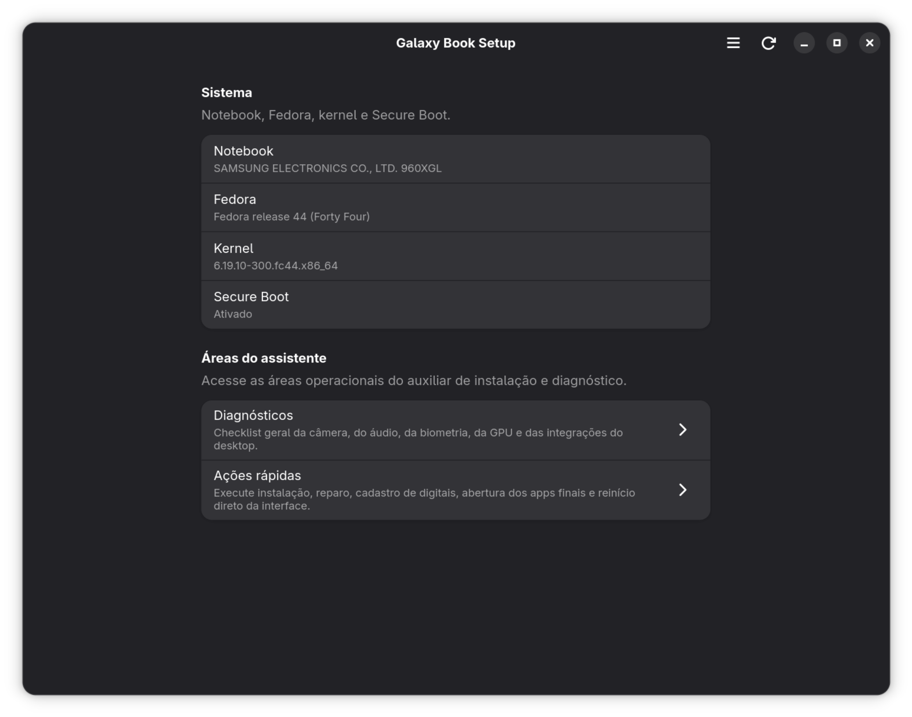
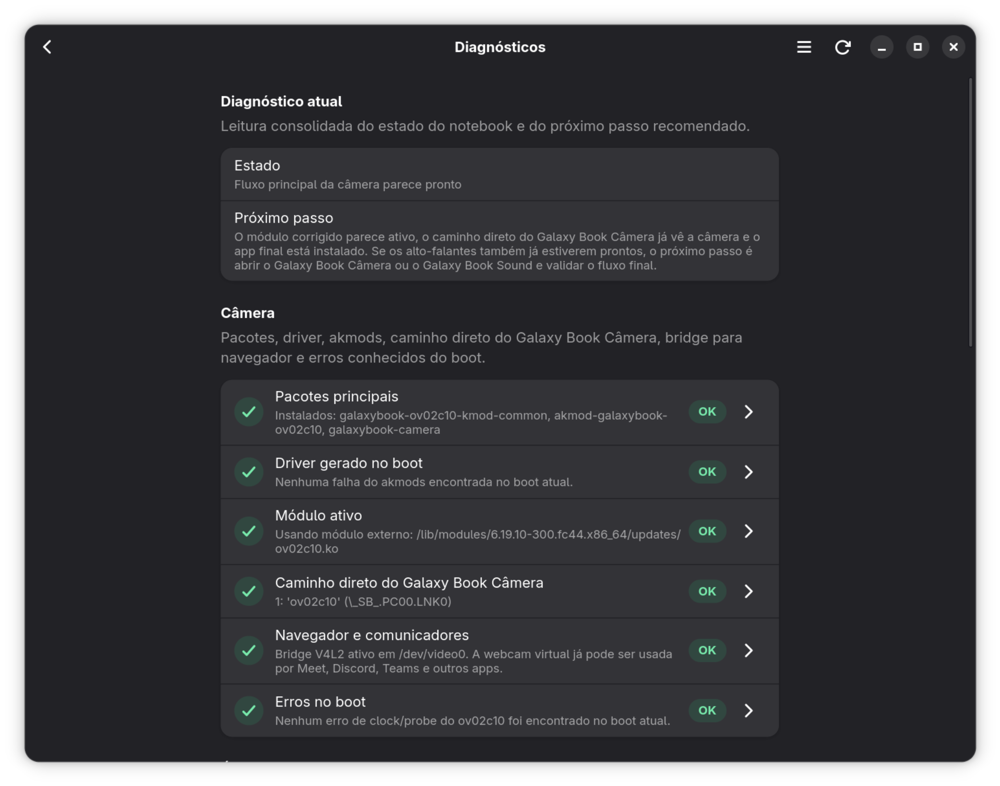
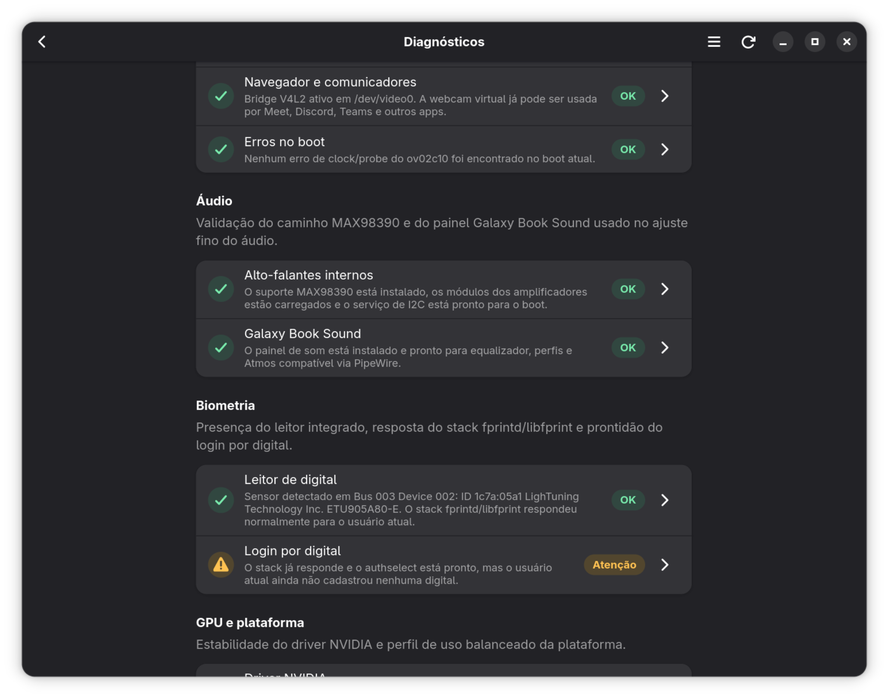
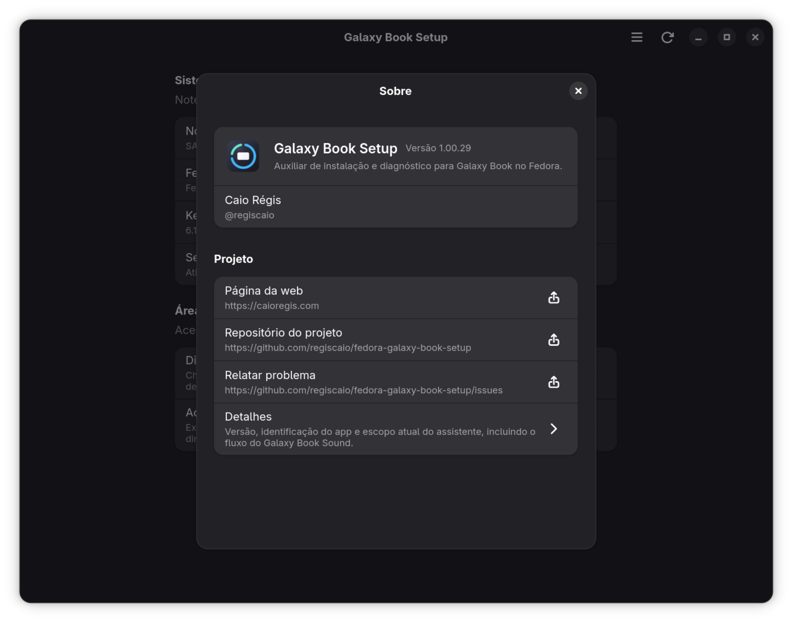

<p align="center">
  
</p>

<h1 align="center">Galaxy Book Setup</h1>

<p align="center">
  <a href="README.md">🇧🇷 Português</a> 
  <a href="README.en.md">🇺🇸 English</a> 
  <a href="README.es.md">🇪🇸 Español</a> 
  <a href="README.it.md">🇮🇹 Italiano</a>
</p>

## Instalação rápida

Para instalar o setup a partir do repositório DNF público:

```bash
sudo dnf config-manager addrepo --from-repofile=https://packages.caioregis.com/fedora/caioregis.repo
sudo dnf install galaxybook-setup
```

Com o repositório configurado, o próprio setup já consegue instalar o conjunto
principal do notebook pela ação rápida `Instalar suporte principal`, puxando o
app de câmera, o driver `OV02C10` e o suporte `MAX98390` dos alto-falantes.
Ele também consegue oferecer a instalação do `Galaxy Book Sound`, que fica
responsável por equalizador, perfis e Atmos compatível.

`Galaxy Book Setup` é um auxiliar de instalação e diagnóstico para notebooks
Samsung Galaxy Book no Fedora. A proposta do app é organizar fluxos de
configuração que normalmente acabam espalhados entre terminal, logs, pacotes
RPM e validações manuais.

O foco inicial é a **câmera interna** do Galaxy Book4 Ultra, mas o projeto já
acompanha também o fluxo dos **alto-falantes internos com MAX98390**, além de
GPU, fingerprint, perfil de plataforma e integrações gerais do sistema.

## Interface atual

### Tela inicial



### Diagnósticos



### Áudio interno



### Modal `Sobre`



## Escopo

Este app não substitui:

- o driver do kernel;
- o app final de câmera;
- ferramentas de baixo nível como `akmods`, `modinfo` ou `journalctl`.

O papel dele é funcionar como um **assistente de instalação e validação**,
mostrando o estado atual da máquina e organizando os próximos passos.

No fluxo de áudio, isso significa separar bem as responsabilidades: o
`Galaxy Book Setup` valida o caminho dos alto-falantes internos, organiza a
instalação e abre o `Galaxy Book Sound`, enquanto equalização, perfis e
`Atmos compatível` ficam no app de som.

## Relação com os outros repositórios

Este projeto trabalha junto com:

- <https://github.com/regiscaio/fedora-galaxy-book-ov02c10>
- <https://github.com/regiscaio/fedora-galaxy-book-max98390>
- <https://github.com/regiscaio/fedora-galaxy-book-camera>
- <https://github.com/regiscaio/fedora-galaxy-book-sound>

Responsabilidades:

- `fedora-galaxy-book-ov02c10`: módulo `ov02c10` empacotado para Fedora;
- `fedora-galaxy-book-max98390`: suporte empacotado aos alto-falantes internos via MAX98390;
- `fedora-galaxy-book-camera`: app de uso diário da câmera;
- `fedora-galaxy-book-sound`: app de equalizador, perfis e Atmos compatível com backend próprio em PipeWire;
- `fedora-galaxy-book-setup`: assistente de instalação, diagnóstico e fluxo.

## Recursos atuais

A versão atual do app já organiza a interface em áreas bem definidas:

- `Sistema`: resumo do notebook, Fedora, kernel e Secure Boot;
- `Diagnósticos`: checklist geral com o estado da câmera, do bridge para
  navegador, do áudio, do `Galaxy Book Sound`, do leitor de digital, da GPU,
  da chave MOK do `akmods` e das integrações do desktop, incluindo a dock do
  GNOME usada neste notebook;
- `Ações rápidas`: instalação, reparo e ajuste de prioridade do driver,
  ativação da webcam para navegador, ativação dos alto-falantes internos,
  preparação da chave do `Secure Boot` para o `MOK`, instalação e abertura do
  `Galaxy Book Sound`, reparo do stack de fingerprint, ativação do login por
  digital, abertura do cadastro de digitais, fluxo NVIDIA, perfil balanceado,
  reaplicação do perfil da dock, reboot e abertura do app da câmera.

Dentro de `Diagnósticos`, cada linha leva para uma subseção de **ações
sugeridas**. Isso permite abrir correções e validações mais relevantes para o
item selecionado sem perder a página geral de `Ações rápidas`.

O app também expõe um resumo de alertas e erros via notificações do desktop. Em
docks e extensões que suportam contador no launcher, o ícone pode mostrar a
quantidade total de itens com `Atenção` ou `Erro` nos diagnósticos.

O checklist cobre hoje:

- pacotes principais da câmera;
- geração do driver no boot via `akmods`;
- origem do módulo `ov02c10` ativo;
- detecção da câmera no caminho direto do `libcamera` usado pelo `Galaxy Book Câmera`;
- bridge V4L2 para navegadores e comunicadores;
- erros conhecidos do boot;
- caminho MAX98390 dos alto-falantes internos, inclusive quando o pacote está
  instalado, mas o kernel atual ainda não expõe `snd-hda-scodec-max98390` via `modinfo`;
- presença do `Galaxy Book Sound`;
- presença do leitor de digital integrado;
- prontidão do login por digital com `fprintd` e `authselect`;
- estado do driver NVIDIA e observação de que `nvidia-smi` é opcional;
- prontidão da chave pública do `akmods` no `MOK` quando `Secure Boot` está ativo;
- perfil de uso da plataforma, com destaque para `balanced`;
- estado do `Dash to Dock`, com checagem do perfil da dock usado neste
  notebook;
- extensões do GNOME como histórico da área de transferência, GSConnect e
  ícones na área de trabalho.

As ações rápidas não apenas copiam comandos: elas executam os fluxos principais
pela própria interface, usando privilégio administrativo quando necessário.

Hoje, as ações disponíveis incluem:

- instalar o suporte principal do notebook diretamente pelo setup, trazendo o
  app de câmera, o driver `OV02C10` e o suporte `MAX98390`;
- instalar o conjunto principal da câmera;
- reconstruir o driver com `akmods`;
- habilitar o carregamento do `ov02c10` no boot e carregar o módulo
  imediatamente;
- forçar a prioridade do driver corrigido em `updates/`, com assinatura para
  Secure Boot quando necessário, sem compressão incompatível e com mensagem
  explícita quando o kernel atual já tentou iniciar a câmera cedo demais;
- restaurar o stack Intel IPU6 empacotado quando o caminho direto do
  `Galaxy Book Câmera` deixa de enxergar o sensor;
- ativar a câmera para navegador via `icamerasrc`, `v4l2-relayd` e
  `v4l2loopback`, preservando o acesso direto do `libcamera`;
- ativar o suporte aos alto-falantes internos via `MAX98390`, com reconstrução
  dos módulos, fallback manual de instalação no kernel atual e serviço de I2C
  no boot;
- preparar a chave do `Secure Boot` para o `akmods`, gerando a chave local,
  criando o pedido de importação no `MOK` e deixando o reboot pronto para o
  `Enroll MOK` no boot;
- instalar o `Galaxy Book Sound` para aplicar equalização e Atmos compatível na
  sessão via PipeWire;
- reinstalar o stack de fingerprint com `fprintd` e `libfprint`;
- habilitar `with-fingerprint` no `authselect`;
- abrir diretamente o cadastro de digitais nas configurações de usuários;
- instalar ou reparar o suporte NVIDIA;
- aplicar o perfil `balanced` da plataforma;
- reaplicar o perfil da dock do GNOME usado neste notebook, reativando o
  `Dash to Dock` e restaurando o comportamento esperado da dock inferior
  auto-ocultável;
- reiniciar o sistema;
- abrir o `Galaxy Book Câmera`;
- abrir o `Galaxy Book Sound`.

## Câmera após atualização de kernel

Depois de uma atualização de kernel, o boot pode tentar carregar o `ov02c10`
antes de o `akmods` terminar de gerar o módulo corrigido para esse kernel. Nesse
estado, o log registra:

```text
external clock 26000000 is not supported
probe with driver ov02c10 failed with error -22
```

Mesmo que `modinfo -n ov02c10` passe a apontar para `updates/` depois que o
`akmods` termina, o grafo IPU6 daquele boot já pode ter sido criado sem o sensor,
fazendo `cam -l` não listar a câmera interna.

O diagnóstico agora trata esse caso como falha do caminho direto da câmera e
sugere `Ajustar prioridade do driver` seguido de reboot. A ação reconstrói e
prioriza o módulo corrigido para o kernel atual; o reboot recria o grafo de mídia
já com o driver correto disponível desde o início do boot.

## Secure Boot e MOK

Se alguma ação rápida falhar com algo como:

```text
modprobe: ERROR: could not insert 'ov02c10': Key was rejected by service
modprobe: ERROR: could not insert 'snd_hda_scodec_max98390': Key was rejected by service
```

o problema não é compilação do módulo em si. Esse erro significa que o kernel
continuou com `Secure Boot` ativo, mas a chave usada para assinar o módulo
ainda não foi aceita no `MOK`.

O caminho esperado é:

```bash
mokutil --test-key /etc/pki/akmods/certs/public_key.der
sudo mokutil --import /etc/pki/akmods/certs/public_key.der
```

Se o `mokutil --test-key` disser que a chave `is already enrolled`, trate isso
como MOK já inscrito. Em algumas versões do Fedora, essa verificação pode
retornar código shell diferente de zero mesmo nesse caso.

O próprio `Galaxy Book Setup` agora expõe a ação rápida
`Preparar chave do Secure Boot`, que:

- gera a chave local do `akmods` com `kmodgenca` quando necessário;
- pede uma senha temporária do `MOK` na interface;
- cria o pedido de importação no `mokutil`;
- atualiza o diagnóstico para mostrar se a chave ficou pronta, pendente de
  reboot ou ainda precisa de atenção.

Depois disso:

1. reinicie o notebook;
2. entre em `Enroll MOK` na tela azul do boot;
3. confirme a senha definida no `mokutil --import`;
4. volte ao Fedora e execute a ação rápida novamente.

As ações rápidas de prioridade do `ov02c10` e de ativação do `MAX98390` agora
fazem essa checagem antes de tentar carregar o módulo, para não deixar o erro
passar como sucesso ou aparecer sem contexto.

## Instalação para usuários

### Via repositório DNF público

O caminho recomendado para usuários finais é:

```bash
sudo dnf config-manager addrepo --from-repofile=https://packages.caioregis.com/fedora/caioregis.repo
sudo dnf install galaxybook-setup
```

Depois disso, dentro do próprio app:

1. abra `Ações rápidas`;
2. execute `Instalar suporte principal`;
3. use as ações específicas se câmera, áudio, NVIDIA ou a dock ainda
   precisarem de ajuste.

### Via RPM local

O projeto também pode ser empacotado localmente:

```bash
make rpm
```

Depois, o RPM pode ser instalado com:

```bash
sudo dnf install /caminho/para/galaxybook-setup-*.rpm
```

## Build

Dependências de build no Fedora:

```bash
sudo dnf install cargo rust pkgconf-pkg-config gtk4-devel libadwaita-devel
```

Se o host não tiver o toolchain completo, o `Makefile` usa um container rootless
com `podman`.

Comandos principais:

```bash
make build
make test
make dist
make srpm
make rpm
```

Para instalar o launcher local de desenvolvimento:

```bash
make install-local
```

## Empacotamento

Arquivos relevantes:

- spec RPM: [`packaging/fedora/galaxybook-setup.spec`](packaging/fedora/galaxybook-setup.spec)
- launcher: [`data/com.caioregis.GalaxyBookSetup.desktop`](data/com.caioregis.GalaxyBookSetup.desktop)
- metadados AppStream: [`data/com.caioregis.GalaxyBookSetup.metainfo.xml`](data/com.caioregis.GalaxyBookSetup.metainfo.xml)

O RPM usa `Recommends` para apontar os pacotes mais importantes do fluxo:

- `akmod-galaxybook-ov02c10`
- `akmod-galaxybook-max98390`
- `galaxybook-camera`

Isso permite que o app seja instalado mesmo antes do setup completo da câmera,
o que é desejável para um auxiliar de instalação.

## Roadmap

Próximas evoluções previstas:

- checagens gerais de compatibilidade do Galaxy Book com Fedora;
- mais fluxos assistidos para integrações do ambiente GNOME e periféricos do notebook;
- aprofundar as leituras de fingerprint com foco em validação pós-suspensão e cenários de sensor ocupado.

## Licença

Este projeto é distribuído sob a licença **GPL-3.0-only**. Veja o arquivo
[LICENSE](LICENSE).
